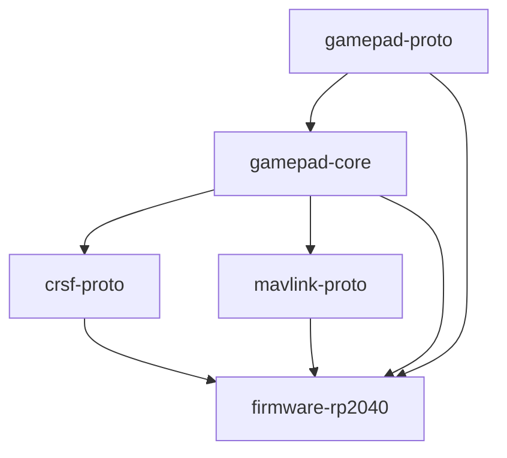
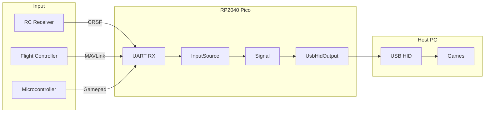
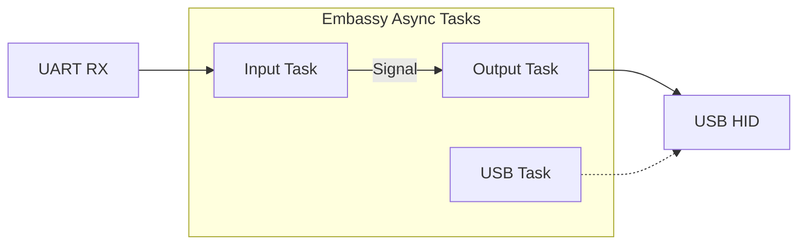

# UART-to-Gamepad

A USB HID gamepad bridge for the Raspberry Pi Pico (RP2040) that receives gamepad state over UART and presents it as a standard USB gamepad to the host computer. Supports multiple input protocols for maximum flexibility.

## Features

- **USB HID Gamepad**: Appears as a standard gamepad to any OS (Windows, macOS, Linux)
- **Multiple Input Protocols**:
  - **Gamepad Protocol**: Custom text-based protocol at 115200 baud (default)
  - **CRSF/ExpressLRS**: RC receiver protocol at 420000 baud
  - **MAVLink**: Drone telemetry protocol (MANUAL_CONTROL messages) at 115200 baud
- **16 Buttons**: Full button support with bitfield encoding
- **Dual Analog Sticks**: Left and right sticks with 16-bit precision
- **Analog Triggers**: Left and right triggers with 8-bit precision
- **Host-Testable**: Protocol crates are chip-agnostic and fully testable on host

## Hardware Requirements

- Raspberry Pi Pico (RP2040) or compatible board
- USB connection to host computer
- UART connection to gamepad state source (e.g., RC receiver, flight controller, another microcontroller)

### Pinout

| Function | GPIO Pin | Description |
|----------|----------|-------------|
| UART1 TX | GPIO 8   | Transmit (directly to source) |
| UART1 RX | GPIO 9   | Receive gamepad data |
| LED      | GPIO 25  | Error indicator (on-board LED) |

## Building

### Prerequisites

```bash
# Install Rust (if not already installed)
curl --proto '=https' --tlsv1.2 -sSf https://sh.rustup.rs | sh

# Add the thumbv6m target for RP2040
rustup target add thumbv6m-none-eabi

# Install elf2uf2-rs for creating UF2 files (optional)
cargo install elf2uf2-rs

# Install probe-rs for debugging (optional)
cargo install probe-rs-tools

# Install just for convenient build recipes (optional)
cargo install just
```

### Build Commands

```bash
# Development build (default: gamepad protocol)
cargo build -p uart-to-gamepad-rp2040

# Release build (optimized for size)
cargo build -p uart-to-gamepad-rp2040 --release

# Build with CRSF protocol (for ExpressLRS/Crossfire receivers)
cargo build -p uart-to-gamepad-rp2040 --release --no-default-features \
    --features "dev-panic,standard-hid,proto-crsf"

# Build with MAVLink protocol (for flight controllers)
cargo build -p uart-to-gamepad-rp2040 --release --no-default-features \
    --features "dev-panic,standard-hid,proto-mavlink"
```

### Flashing

**Using UF2 (no debugger required):**

1. Hold BOOTSEL button on the Pico while connecting USB
2. Copy the UF2 file to the mounted drive:

```bash
elf2uf2-rs target/thumbv6m-none-eabi/release/uart-to-gamepad-rp2040 uart-to-gamepad.uf2
cp uart-to-gamepad.uf2 /Volumes/RPI-RP2/
```

**Using probe-rs (with debug probe):**

```bash
probe-rs run --chip RP2040 target/thumbv6m-none-eabi/release/uart-to-gamepad-rp2040
```

### Using justfile

A `justfile` is provided for convenient build recipes:

```bash
just build gamepad              # Release build, gamepad protocol
just build crsf                 # Release build, CRSF protocol
just build mavlink              # Release build, MAVLink protocol
just build gamepad dev          # Dev build with debug info
just build crsf production      # Production build (optimized, panic-reset)
just build-all                  # Build all protocols (release)
just test                       # Run all host tests
just check                      # Check all variants compile
just clippy                     # Run lints
just size gamepad               # Show binary size
just run crsf                   # Run via probe-rs
just uf2 mavlink                # Generate UF2 file
just clean                      # Clean build artifacts
```

Run `just` or `just --list` to see all available recipes.

## Testing

The project uses chip-agnostic protocol crates that enable fast host-based testing.

```bash
# Run all library tests on host (macOS ARM)
cargo test -p gamepad-proto -p gamepad-core -p crsf-proto -p mavlink-proto \
    --target aarch64-apple-darwin

# Run all library tests on host (Linux x86_64)
cargo test -p gamepad-proto -p gamepad-core -p crsf-proto -p mavlink-proto \
    --target x86_64-unknown-linux-gnu
```

## Architecture

### Crate Dependencies



### System Overview



### Firmware Task Flow



## Workspace Crates

| Crate | Description |
|-------|-------------|
| [gamepad-proto](gamepad-proto/) | Text-based gamepad protocol (parsing & serialization) |
| [gamepad-core](gamepad-core/) | Core types and traits (InputSource, OutputSink) |
| [crsf-proto](crsf-proto/) | CRSF/ExpressLRS protocol (chip-agnostic) |
| [mavlink-proto](mavlink-proto/) | MAVLink protocol (chip-agnostic) |
| [firmware-rp2040](firmware-rp2040/) | RP2040 firmware implementation |

## License

This project is licensed under the MIT License - see the [LICENSE](LICENSE) file for details.

## Contributing

Contributions are welcome! Please feel free to submit issues and pull requests.

When contributing code:
1. Run all tests: `cargo test -p gamepad-proto -p gamepad-core -p crsf-proto -p mavlink-proto --target aarch64-apple-darwin`
2. Run lint checks: `cargo clippy -p uart-to-gamepad-rp2040`
3. Verify all firmware variants build:
   ```bash
   cargo build -p uart-to-gamepad-rp2040 --release
   cargo build -p uart-to-gamepad-rp2040 --release --no-default-features --features "dev-panic,standard-hid,proto-crsf"
   cargo build -p uart-to-gamepad-rp2040 --release --no-default-features --features "dev-panic,standard-hid,proto-mavlink"
   ```
