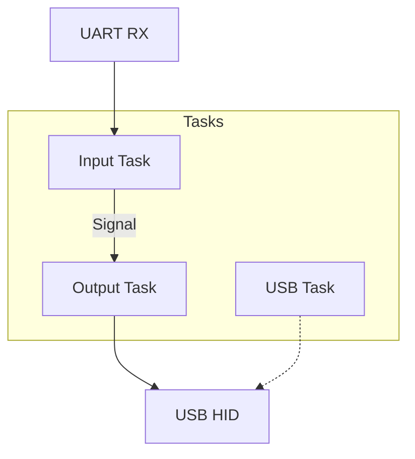

# firmware-rp2040

RP2040 firmware for the UART-to-Gamepad bridge. Runs on Raspberry Pi Pico and compatible boards.

## Features

### Panic Handlers (mutually exclusive)

| Feature | Default | Description |
|---------|---------|-------------|
| `dev-panic` | Yes | Use `panic-probe` for debugging (prints panic via RTT) |
| `prod-panic` | No | Use `panic-reset` for production (silent reset) |

### HID Descriptors (mutually exclusive)

| Feature | Default | Description |
|---------|---------|-------------|
| `standard-hid` | Yes | Standard HID gamepad (cross-platform) |
| `xinput-compat` | No | Xbox-style descriptor (better Windows game support) |

### Input Protocols (mutually exclusive)

| Feature | Default | Baud Rate | Description |
|---------|---------|-----------|-------------|
| `proto-gamepad` | Yes | 115200 | Text-based gamepad protocol |
| `proto-crsf` | No | 420000 | CRSF/ExpressLRS RC protocol |
| `proto-mavlink` | No | 115200 | MAVLink MANUAL_CONTROL messages |

### Hardware Options

| Feature | Default | Description |
|---------|---------|-------------|
| `uart-flow-control` | No | Enable CTS/RTS on GPIO 10/11 |

## Hardware Configuration

| Function | GPIO | Description |
|----------|------|-------------|
| UART1 TX | 8 | Serial transmit |
| UART1 RX | 9 | Serial receive |
| LED | 25 | On-board LED (error indicator) |
| UART1 CTS | 10 | Clear to Send (optional) |
| UART1 RTS | 11 | Request to Send (optional) |

## Building

```bash
# Default (gamepad protocol)
cargo build -p uart-to-gamepad-rp2040 --release

# CRSF protocol
cargo build -p uart-to-gamepad-rp2040 --release \
    --no-default-features --features "dev-panic,standard-hid,proto-crsf"

# MAVLink protocol
cargo build -p uart-to-gamepad-rp2040 --release \
    --no-default-features --features "dev-panic,standard-hid,proto-mavlink"

# Production build (optimized, no debug)
cargo build -p uart-to-gamepad-rp2040 --profile production
```

## Flashing

### UF2 (no debugger)

1. Hold BOOTSEL while connecting USB
2. Convert and copy:

```bash
elf2uf2-rs target/thumbv6m-none-eabi/release/uart-to-gamepad-rp2040 firmware.uf2
cp firmware.uf2 /Volumes/RPI-RP2/  # macOS
# cp firmware.uf2 /media/$USER/RPI-RP2/  # Linux
```

### probe-rs (with debugger)

```bash
probe-rs run --chip RP2040 target/thumbv6m-none-eabi/release/uart-to-gamepad-rp2040
```

### Using justfile

From the workspace root, use the justfile for convenient builds:

```bash
just build gamepad              # Release build
just build crsf dev             # Dev build with CRSF
just build mavlink production   # Production build
just run gamepad                # Run via probe-rs
just uf2 crsf                   # Generate UF2 file
```

## Architecture

The firmware uses Embassy async runtime with three concurrent tasks:



### Signal-Based Communication

Tasks communicate via Embassy's `Signal` with "latest value wins" semantics:
- Input task signals the latest gamepad state
- Output task waits for signals and sends HID reports
- Stale values are automatically discarded

## Input Sources

Each protocol has a dedicated input source:

| Protocol | Type | Module |
|----------|------|--------|
| Gamepad | `UartInputSource` | `input::gamepad` |
| CRSF | `CrsfInputSource` | `input::crsf` |
| MAVLink | `MavlinkInputSource` | `input::mavlink` |

All implement the `InputSource` trait from `gamepad-core`.

## USB HID

The firmware presents as a standard USB HID gamepad:
- VID: 0x1209 (pid.codes)
- PID: 0x0001 (test PID)
- 16 buttons, 2 analog sticks, 2 triggers

## License

MIT
